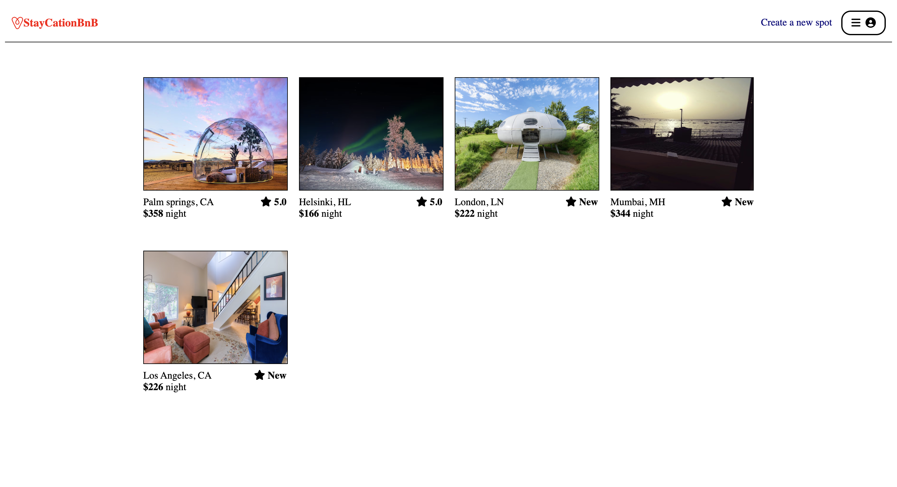
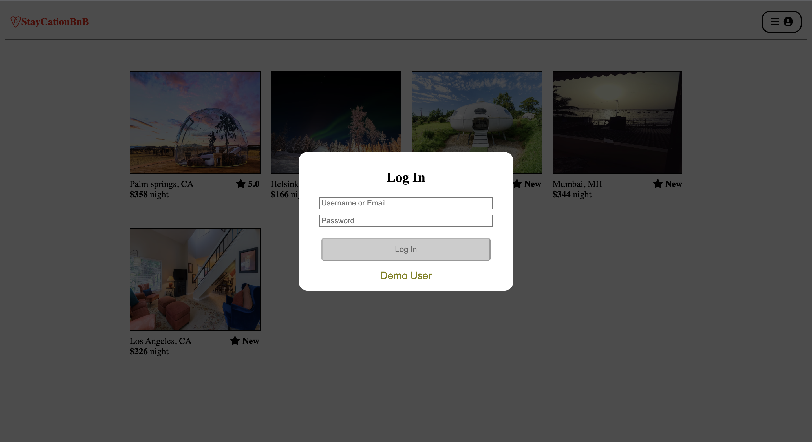
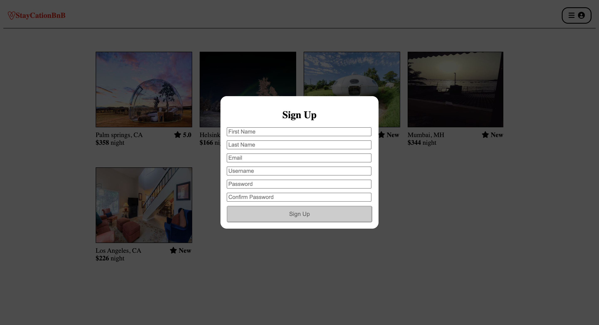
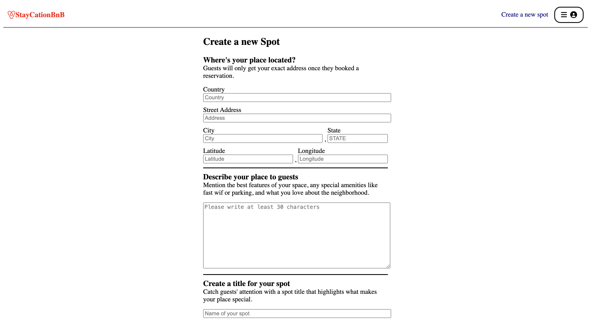
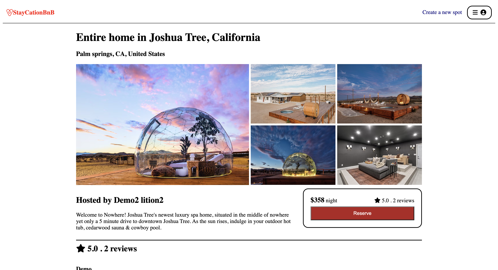
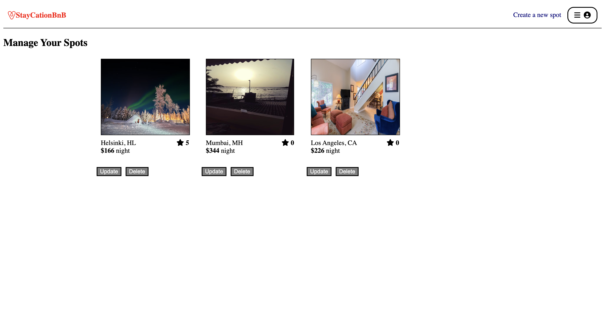

## AirBnB Clone

# StayCationBnB

<br>

## Table of Contents

- [Link to Live Site](https://github.com/shreyadarekar/StayCationBnb#link-to-live-site)
- [Description](https://github.com/shreyadarekar/StayCationBnb#description)
- [Getting Started](https://github.com/shreyadarekar/StayCationBnb#getting-started)
- [Technologies](https://github.com/shreyadarekar/StayCationBnb#technologies)
- [Features](https://github.com/shreyadarekar/StayCationBnb#features)
- [Wireframes](https://github.com/shreyadarekar/StayCationBnb#wireframes)
- [Screenshots](https://github.com/shreyadarekar/StayCationBnb#screenshots)

<br>

## Link to Live Site

[StayCationBnB Live Site](https://staycationbnb.onrender.com/)

<br>

## Description

StayCationBnB is a clone of AirBnB. The main features of the site include sign-up/login, creating/editing/deleting a spot, adding/modifying/deleting a review.

<br>

## Getting Started

1. Clone this repository

   ```bash
   git clone https://github.com/shreyadarekar/StayCationBnB.git
   ```

2. Install dependencies

   ```bash
   npm install
   ```

3. Create a **.env** file based on the .env.example file with secret key of your choice. Recommendation to generate a strong secret: create a random string using `openssl` (a library that should already be installed in your Ubuntu/MacOS shell). Run `openssl rand -base64 10` to generate a random JWT secret.

4. Setup your Database by running the following command

   ```bash
   npm sequelize
   ```

5. Run backend

   ```bash
   npm start
   ```

6. To run the React App, go inside the `frontend` directory, `npm start`. This should open your browser automatically but if not, you may navigate to `localhost:8000` to access the application.

<br>
<br>

## Technologies

<br>
<p float="left">
  
  &nbsp;
  
  &nbsp;
  
  &nbsp;
  
  &nbsp;
  
  &nbsp;
  
  &nbsp;
</p>

<br>

## Features

- The home page displays a list of all of the spots on the platform
- Users can add new spots
- Users can see existing spots, and edit/delete spots that they own
- Users can post reviews (with a rating) to an existing spot (also read, edit and delete)
- Users can add (or remove) spots to/from their list of favorites
- Unauthenticated users can view all spots and reviews but may not add a new review or spot

<br>

## Wireframes

- [Design review](https://appacademy-open-assets.s3.us-west-1.amazonaws.com/Modular-Curriculum/content/week-16/AirBnB+MVP+Wireframes.pdf)

<br>

## Screenshots







